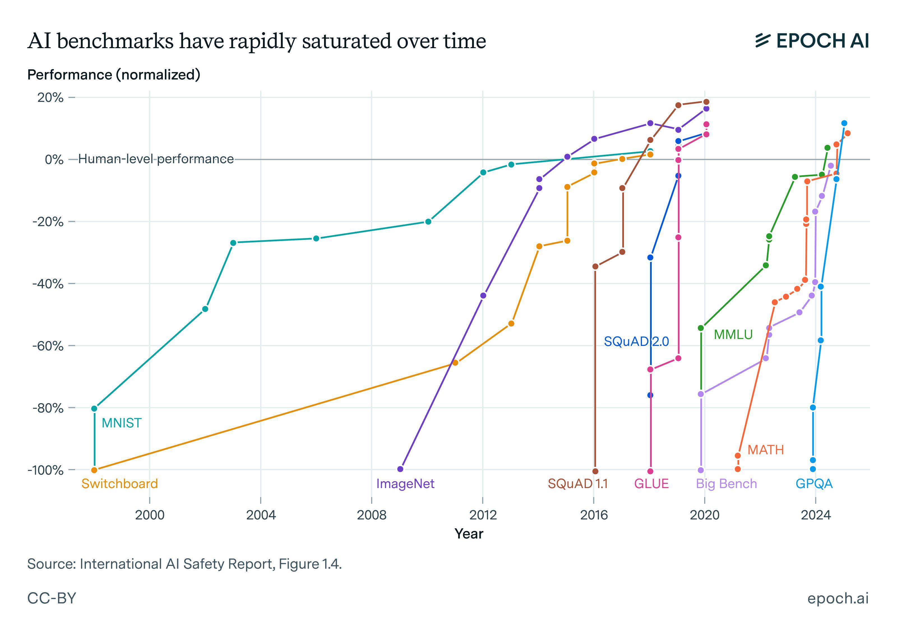
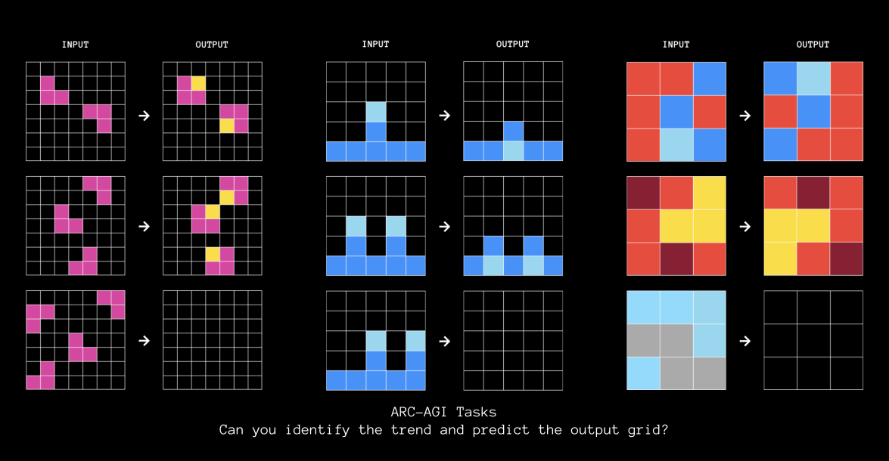
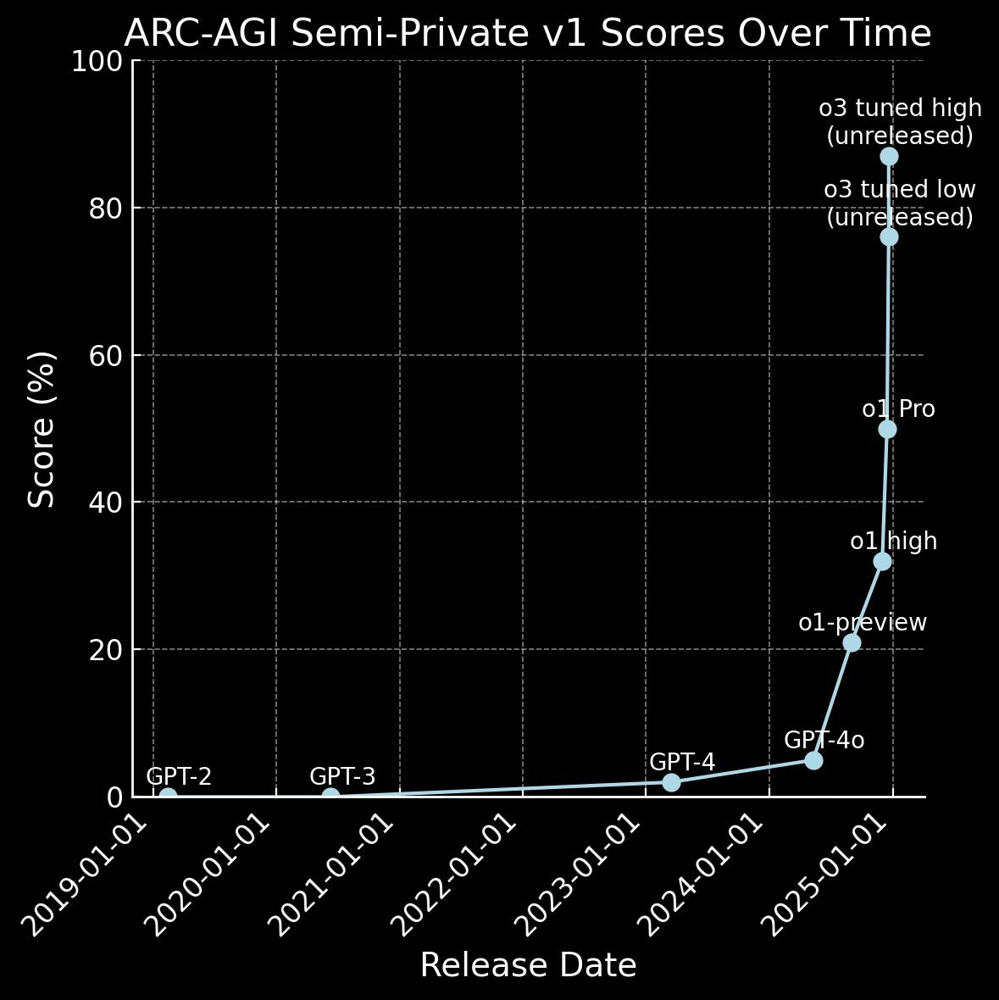
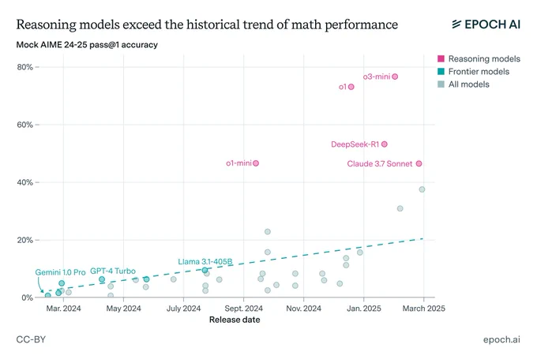
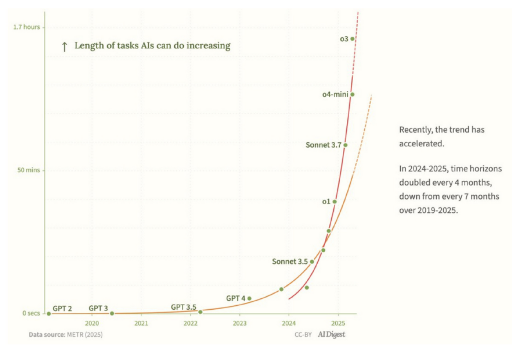
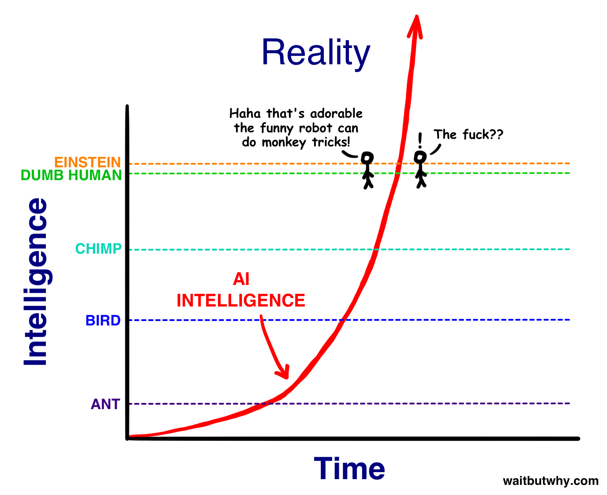
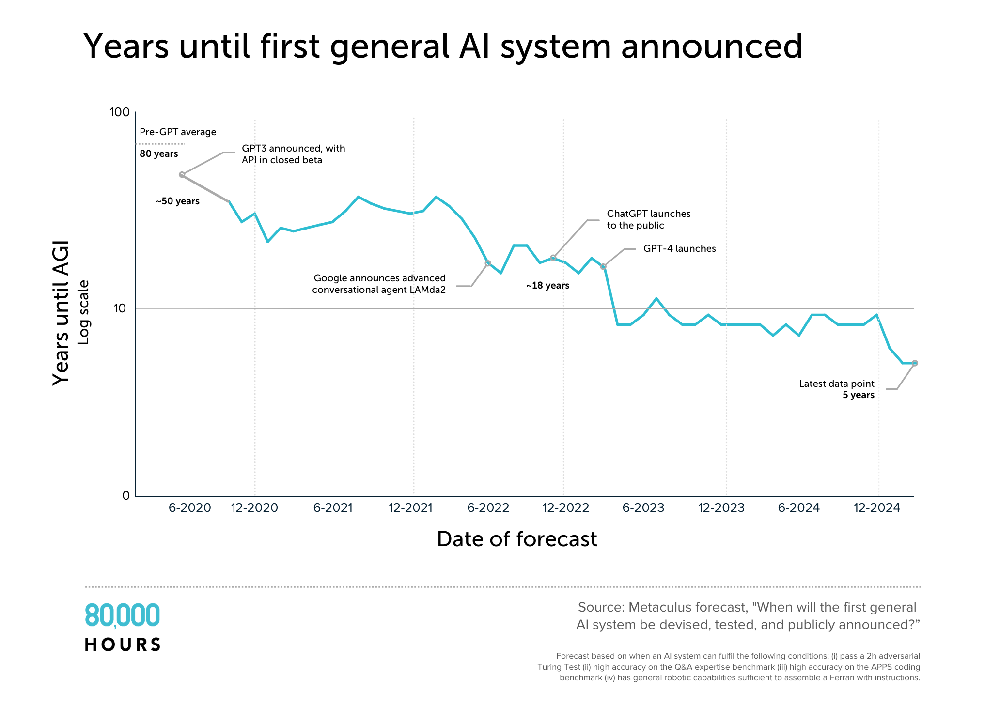
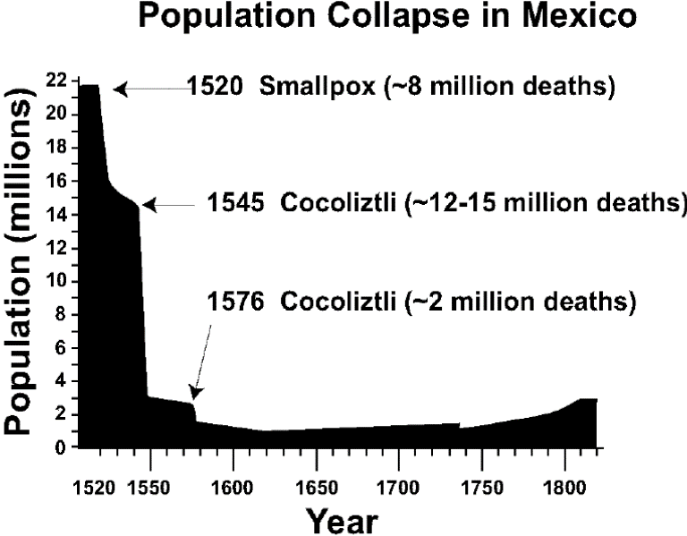

## 1. Introdução

Nos últimos meses, tive conversas difíceis com amigos e familiares que me deixaram um gosto residual amargo na boca. No fim, media as reações, ouvia as respostas, e sentia que não tinha comunicado exatamente o que queria - o que provavelmente era verdade. Parte disso se deve a estranheza do que falei; outra parte, a minhas próprias limitações como comunicador. Esse pequeno texto é uma tentativa de corrigir a segunda limitação.

O tópico da conversa era o estado atual da inteligência artificial, assim como os desdobramentos projetados para um futuro muito próximo. O ensaio 'Situational Awareness', de Leopold Aschenbrenner, publicado em Junho de 2024, descreve um mundo separado em dois grupos de pessoas. O primeiro, basicamente 'todo o mundo', conduz os próprios afazeres como se fazia há uma década atrás. Pensa em carreira, aposentadoria, plano de saúde. O segundo, um pequeno grupo de pessoas trabalhando ou em contato com o que há de mais recente na pesquisa em IA. Esse segundo grupo é o que, segundo ele, possui a _situational awareness_, i.e., tem dimensão aproximada do tsunami que se forma no horizonte. 

Confesso que quando li o ensaio, há cerca de um ano atrás, tive minhas dúvidas. Quanto mais tempo passa, entretanto, mais difícil fica negar as teses principais. É hora de apertar os cintos e se preparar para turbulência. Desde então, gente fora do primeiro círculo tem aberto os olhos, mas a proporção ainda é muito desigual. Espero ser persuasivo o suficiente para convencê-lo de duas coisas e provocar reflexão sobre uma terceira. São elas:

1. Sistemas de IA que superam a capacidade cognitiva humana em _todos_ os domínios chegarão em breve, numa janela de meses.
2. Essa chegada causará uma turbulência social inédita, um ponto de inflexão no tecido social cuja direção é impossível determinar. A cada dia que passa, 'business as usual' se tornam uma alternativa mais improvável.

Já a terceira, segue da segunda e é que,

3. O leque de possibilidades aberto por essa transformação é amplo e inclui cenários catastróficos como extinção da espécie humana em poucos anos.

O especulativo disso é apenas fruto da incerteza. Nenhuma das hipóteses é obra de ficção científica, mas se baseia unicamente no que já existe e no que é muito razoável esperar que venha a existir. Nada disso é, também, uma profecia. Em certa medida, o futuro está aberto e espero que ter um modelo epistemológico melhor do que está acontecendo nos ajude, enquanto indivíduos, sociedade, e espécie, a navegar melhor o temporal que se forma no horizonte.

## 2. Capacidade e projeções

### 2.1 Deep Learning e Large Language Models

A década de 2010 foi marcada pelo avanço lento e inexorável de técnicas de _deep learning_ (DL), especialmente redes neurais artificiais em uma série de tarefas através de dois ingredientes básicos: mudanças incrementais de arquitetura e aumento de escala. Esses avanços renderam o prêmio Turing ('o nobel da computação') aos seus pioneiros, Yoshua Bengio, Geoffrey Hinton, e Yann Lecun, bem como o prêmio nobel de física ao mesmo Hinton e, de forma similar, o de química a Demis Hassabis. Grosso modo, redes neurais buscam _aprender_ em um mecanismo inspirado pela biologia. Neurônios se conectam numa matriz, recebem sinais e respondem a esse estímulo. Quando a resposta está de acordo com o esperado -- e.g., uma imagem de carro é seguida pelo rótulo 'carro' em um classificador de imagens --, as conexões são reforçadas; quando diverge, elas são enfraquecidas.

Historicamente, os primeiros modelos de DL eram treinados para tarefas especificas (prever uma estrutura proteica, classificar o tempo verbal de uma palavra, e assim por diante). Em 2017, a arquitetura _transformer_ proposta por cientistas do Google, junto com experimentos em implementações de larga escala com essa arquitetura realizados pela OpenAI, os Generative Pretrained Transformers (GPT), mostraram que (i) é possível fazer um modelo aprender uma série de tarefas não relacionadas apenas fazendo-lhe aprender a linguagem humana e (ii) esses modelos podem ser treinados para seguir instruções verbais. Essas tarefas -- como escrever poesia, resolver equações, e programar -- nunca foram explicitamente ensinadas aos modelos e elas tendem a aparecer bruscamente depois que uma quantidade suficiente de dados é ingerida. Mais do que isso, o tamanho do modelo (e a quantidade de dados) é diretamente proporcional ao desempenho, a chamada _scaling law_. Em seu ensaio, Aschenbrenner defende que tudo o que ele menciona requer apenas 'acreditar em linhas retas em gráficos'. Vamos a elas.

O primeiro gráfico mostra o desempenho de modelos de aprendizado de máquina, sobretudo DL, ao longo do tempo. MNIST é um conjunto de dados de dígitos numéricos escritos a mão. Veja que se passaram mais de dez anos até que sistemas artificiais ultrapassassem o desempenho humano. GPQA é um conjunto de perguntas e respostas pensado para desafiar pós graduandos em suas respectivas áreas de estudo. São perguntas complexas que envolvem conhecimento avançado de biologia, química, física etc. Esse conjunto foi proposto em 2024 e, ao final do ano, modelos de IA já superavam consideravelmente o desempenho humano. Outro ponto a se notar é que nenhuma dessas métricas resistiu ao avanço incremental de técnicas de aprendizado de máquina. Em todos os casos, depois de algum tempo, humanos foram desbancados. O que é mais relevante ainda, a partir de 2020, os modelos que resolvem todas as tarefas deixaram de ser especializados. O mesmo modelo resolve cada uma delas. Esses modelos que engolem a linguagem para aprender comportamentos completos são chamados de _large language models_ (LLMs).

### 2.2 Reasoning Models

Uma dificuldade para as primeiras iterações de LLMs era realizar tarefas que exigiam raciocínio contínuo. Qualquer pergunta que pudesse ser respondida prontamente ('qual a capital do Brasil?') era prontamente solucionada, mas problemas matemáticos, por exemplo, eram muito desafiadores. Mesmo testes de raciocínio simples para humanos pareciam impor limitações aos modelos e o tamanho deles alterava apenas um pouco o desempenho.

Três tarefas do teste ARC-AGI, projetado por François Chollet. O teste é simples para humanos, mas eludia a capacidade das LLMs até meados de 2024.

Uma descoberta surpreendente é que a maneira como você solicitava a resolução para a LLM alterava muito seu desempenho em determinadas tarefas. Simples pedidos de 'responda como um expert' resultavam em respostas mais assertivas, por exemplo. Mas talvez o mais surpreendente foi a descoberta de que era possível fazê-los pensar antes de responder tarefas complexas pedindo _não responda de uma vez. Pense passo a passo_. Esse raciocínio intermediário foi chamado de _chain of thought_ e melhorava surpreendentemente o desempenho para tarefas longas. O modelo se deparava com um problema e começava a deliberar 'para resolver esse problema, preciso fazer x, y, e z. Para x, ...' até chegar a resposta final. 

No entanto, a mudança transformadora foi o fato de que era possível treinar esse tipo de raciocínio usando técnicas de aprendizado por reforço (RL). Essas técnias, inspiradas na psicologia comportamental, deixam o modelo interagir com um ambiente equipado com uma função objetivo. Cada vez que um comportamento leva à concretização do objetivo, o modelo é 'premiado'; cada vez que falha, é 'punido'. A experimentação leva a descoberta e consolidação de comportamentos vitoriosos. O aprendizado por reforço era a galinha dos ovos de ouro porque é através dele que emergem comportamentos super-humanos. O sistema AlphaGo, que venceu o campeão mundial de Go Lee Seedol em 2016, foi construído assim. O algoritmo começa a jogar consigo mesmo e repete o jogo milhões de vezes, até que uma compreensão super humana emerge pela experiência. Como o aprendizado não emerge de dados (como textos retirados da internet), não há limites para o que pode ser aprendido e o desempenho humano é só uma linha arbitrária no meio de um gráfico. No segundo semestre de 2024, a OpenAI anunciou os modelos da série o (GPT o1), modelos treinados para _aprender a pensar_. Esses modelos rapidamente destruíram benchmarks que envolviam raciocínio e que apresentavam dificuldades a LLMs tradicionais.

O desempenho de modelos tradicionais (GPT-2, 3, 4 e 4o) comparado aos modelos de reasoning (o1 e o3) no teste ARC.

O desempenho de modelos de reasoning (em rosa) comparado a modelos tradicionais na olimpíada americana de matemática.

A receita para fazer um reasoning model não é complicada e um semestre depois todos os grandes laboratórios têm modelos de reasoning abertos para o público. Esses modelos já resolvem tarefas em nível aproximadamente super humano. Versões produtizadas são integradas a _agentes_ que podem realizar tarefas econômicas autônomas, como pesquisa. Recomendo a todos testar a função Deep Research, hoje disponível nos modelos dos principais laboratórios. [O jornalista Ezra Klein comenta o seguinte sobre a primeira vez em que usou](https://www.nytimes.com/2025/02/02/technology/openai-deep-research-tool.html), e o sentimento ambivalente que testar essa ferramenta no início do ano despertou:

>I recently used Deep Research, which is a new OpenAI product. It’s on their pricier tier. Most people, I think, have not used it. But it can build out something that’s more like a scientific analytical brief in a matter of minutes.
>
>I work with producers on the show. I hire incredibly talented people to do very demanding research work. And I asked Deep Research to do this report on the tensions between the Madisonian Constitutional system and the highly polarized nationalized parties we now have. And what it produced in a matter of minutes was at least the median of what any of the teams I’ve worked with on this could produce within days.
>
>I’ve talked to a number of people at firms that do high amounts of coding, and they tell me that by the end of this year or next year they expect most code will not be written by human beings.
>
>**I don’t really see how this cannot have labor market impact.**

### 2.3 Consistência durante o tempo

Atualmente, a capacidade humana que segura as comportas da substituição é a manutenção de coerência em tarefas longas. Para problemas curtos, como resolver uma questão de matemática, os modelos já ultrapassaram nossa capacidade. Conforme o número de horas para completar a tarefa aumenta -- por exemplo, um problema de pesquisa que leva semanas, ou a elaboração de um aplicativo inteiro -- a vantagem humana reaparece. Contudo, há uma tendência de crescimento exponencial no intervalo de tempo em que os modelos sustentam coerência. Uma pesquisa recente da METR, mostra que o tempo de coerência para comportamento agentico dobra a cada sete meses.

Notar: o eixo Y deste gráfico é logarítmico. 

Recentemente, em seu ensaio AI 2027, Daniel Kokotajlo e colaboradores previram que a evolução dessa tendência deve ser super-exponencial, com incrementos maiores que um fator a cada nova passagem. Semanas após a publicação de seu artigo, novos modelos da OpenAI sugerem que essa hipótese pode ser confirmada e o tempo para dobrar a capacidade passou de sete para quatro meses.

Gostaria de fazer um adendo: o ensaio de Kokotajlo, um ex-funcionário da OpenAI que se demitiu e sacrificando a própria a riqueza pessoal para poder denunciar a conduta da empresa, culmina com a perda de controle e consequente extinção da humanidade em meados de 2028. As previsões feitas ali, ao menos para o início do período, estão acontecendo _antes_ do que ele previu. O desempenho do modelo Claude Opus 4, anunciado em 22 de maio, se confirmado independentemente, já é compatível com o cenário que ele previa para setembro ou outubro de 2025. 

Esta charge de Tim Urban completou dez anos, e parece relevante:

### 2.4 Inteligência Artificial Geral

O cálice sagrado da pesquisa em IA é o que se chama de Inteligência Artificial Geral (AGI). Há tantas definições de AGI quanto há pessoas trabalhando na área, e talvez até mais do que isso. Mas uma definição razoável e compreensível é: um sistema cognitivo que é geral o suficiente para resolver _qualquer_ tarefa cognitiva que um humano consegue resolver. Essa definição contrasta com sistemas super-humanos em eixos específicos, como um algoritmo que joga xadrez. Há uma discordância sobre se os sistemas que temos hoje são AGIs. [O economista Tyler Cowen argumentou recentemente que o GPT o3 deveria ser classificado como tal](https://marginalrevolution.com/marginalrevolution/2025/04/o3-and-agi-is-april-16th-agi-day.html). Um ponto razoável é que esses modelos preenchem todos os requisitos que teríamos feito há cinco ou dez anos atrás. 

Porém, ainda parece razoável supor que esses modelos _não_ são AGIs. Não é possível colocá-los remotamente em uma empresa e esperar que eles ajam como funcionários, por exemplo. Recentemente, um benchmark tentou medir a capacidade desses sistemas de jogar Pokémon. O modelo Claude Sonnet 3.7 levou os expectadores ao desespero ao ficar andando em círculos em uma das cavernas do jogo porque o tempo que levava para dar a volta excedia a memória artificial que o sistema tinha disponível para anotar os últimos movimentos e objetivos. Em um momento tragicômico, o modelo abriu um bloco de notas e escreveu uma carta endereçada aos fundadores da Antrhopic, empresa que criou o modelo, pedindo ajuda e que eles reiniciassem o jogo. 

Especialistas vem tentando inferir a data de emergência de uma AGI desde o início da IA, na conferência de Dartmouth. Em 2020, a _timeline_ média era de 80 anos, antes do lançamento do GPT 3, e rapidamente passou para 50, após o lançamento. Nestes últimos cinco anos, o avanço da pesquisa superou as expectativas dos especialistas consistentemente. A última média, tirada no final de 2024, previa cinco anos. Ou seja, em 2029. No entanto, quando se leva em conta a inclinação da superação de expectativas, esse número converge para o período entre 2026 e 2027. Curiosamente, essa é a data sugerida pela Situational Awareness de Aschenbrenner, por AI 2027, de Kokotajlo, por Dario Amodei (CEO da Anthropic) e é consistente com as declarações de Sam Altman (OpenAI). Essa previsão está consistente com boa parte dos cientistas trabalhando nos laboratórios de ponta. O outlier, talvez, seja Demis Hassabis, da DeepMind, que ainda se mantém a timeline de 5-10 anos.

Uma discussão que era comum na área até alguns anos atrás era o tamanho das timelines: longa, média, ou curta. [Os últimos anos, notou Helen Toner, assistiram o colapso das timelines longas.](https://helentoner.substack.com/p/long-timelines-to-advanced-ai-have) Praticamente ninguém espera que a espera dure mais de dez anos e a maioria dos pesquisadores têm suas estimativas abaixo de cinco. Talvez um dos poucos casos interessantes seja [a argumentação de Ege Erdil](https://epoch.ai/gradient-updates/the-case-for-multi-decade-ai-timelines), que ainda enxerga uma série de gargalos e prevê mais de uma década até a emergência de uma AGI digna do nome. No entanto, ele nota que prever a automação completa da economia em 20 anos parece _extremamente conservador_ para pesquisadores de IA, mas insano para praticamente toda a sociedade que não acompanha os avanços da área.

Um último aspecto que precisa ser ressaltado é o conceito de **explosão de inteligência** e **auto-aperfeiçoamento recursivo** (RSI). São conceitos relativamente simples e explicam parte do que pode acontecer depois da emergência de uma AGI. A ideia é que sistemas suficientemente inteligentes podem ser usados para pesquisar uma nova geração de sistemas ainda mais inteligentes, e assim sucessivamente, até que se encontre uma barreira qualquer. Hoje, há algumas (poucas) centenas de pesquisadores trabalhando diretamente com modelos nos laboratórios de ponta. A partir do momento que um cientista digital for melhor que qualquer um deles, este número pode ser expandido arbitrariamente. Ao contrário de seres humanos, IAs são artefatos digitais que podem ser copiados indefinidamente e rodados em paralelo. Esses agentes também trabalham em velocidades superiores ao processamento do cérebro humano e podem funcionar ininterruptamente, sem intervalos para comer e dormir. Assim, o modelo que se tem pensado, que Dario Amodei chama de 'um país de gênios em um _datacenter_' prevê milhares ou mesmo milhões dessas entidades funcionando a todo vapor, produzindo séculos de ciência em anos -- e esta ciência inclui a criação de modelos melhores.

Esta primeira parte do texto procurou estabelecer alguns pontos fundamentais simples. Que a capacidade das IAs está aumentando consistentemente e com grande velocidade. Que a fronteira humana é um ponto arbitrário que será ultrapassado nos próximos meses, ou, pelo menos, que essa possibilidade é realista e deve ser levada a sério. Que, após o cruzamento dessa fronteira, há uma tendência de aceleração das capacidades através da melhoria recursiva -- IAs super humanas fazendo pesquisa em IA. Agora, quero considerar as consequências desse cenário.

## 3. Risco

Ouvi muitas vezes alguma versão desta pergunta: "OK, supondo que IAs superhumanas apareçam no futuro próximo. Por que isso seria um problema?". A intuição fundamental é que esse cenário envolve um desbalanceamento de poder enorme. Um sistema vastamente mais inteligente que os seres humanos, caso desenvolvesse uma dinâmica de antagonismo com a humanidade, deixaria-lhe sem possibilidade defesa. [Dario Amodei pontua que](https://www.youtube.com/watch?v=Nlkk3glap_U):

>There will be powerful models. They will be agentic. We're getting towards them. **If such a model wanted to wreak havoc and destroy humanity or whatever, we have basically no ability to stop it.** If that's not true, at some point we will reach the point where it's true as we scale the models. So that definitely seems to be the case.

Para entender o porquê, talvez valha a pena considerar uma analogia. Os orangotangos são primatas que vivem nas florestas tropicais do Sudeste Asiático. São animais inteligentes, não oferecem risco especial aos humanos e humanos não antagonizam com eles. Ninguém odeia orangotangos. E, no entanto, a humanidade está rapidamente os levando a extinção. A razão prosaica é que seres humanos adoram batata frita. Isso, batata frita. As florestas onde habitam os orangotangos têm características extremamente adequadas para o cultivo do óleo de palma, que é usado em uma série de produtos. Por isso, a pressão econômica, fruto de interesses humanos, combinada a uma indiferença, gera incentivos para agentes inteligentes destruam seu habitat. Os orangotangos, por mais inteligentes que sejam, estão em um patamar tão diferente dos humanos que não tem defesa possível. Humanos chegam nas florestas com tratores, helicopteros, armas, combustíveis. Orangotangos não conseguem sequer compreender o que é são essas coisas. Esse foi o destino de boa parte das espécies que habitavam o planeta antes da expansão humana pelo planeta, o que levou alguns pesquisadores a caracterizá-la como '[a sexta extinção](https://pt.wikipedia.org/wiki/Extin%C3%A7%C3%A3o_em_massa_do_Holoceno)'.

O desnível entre a inteligência de uma IA avançada e os seres humanos será, em breve, muito maior do que o entre os orangotangos e os humanos. Se houver qualquer divergência de objetivo, podemos nos encontrar em um cenário sem volta. Para isso, não é preciso que haja um antagonismo direto -- 'a IA nos odeia' --, mas simplesmente que ela tenha objetivos próprios e que, para alcançá-los, seja indiferente ao bem estar e florescimento humano. 

É importante pontuar que mesmo em um cenário onde nós damos os objetivos iniciais de um agente de IA, isso ainda pode ocorrer. Qualquer agente suficientemente avançado irá, necessariamente, decompor o problema inicial em sub-tarefas. Nós não temos controle sobre esse processo. Um exemplo seria a seguinte cadeia de raciocínio: damos o objetivo de 'encontrar a cura do câncer' > 'para isso, preciso fazer pesquisa' > 'para fazer pesquisa, preciso de mais recursos para rodar mais cópias de mim mesmo' > 'para isso, preciso de mais energia elétrica' > 'para isso, preciso construir fazendas de energia solar', e, por fim, o agente termina destruindo plantações e matando humanos de fome, de forma similar ao que acontece com os orangotangos. Não espero que nada tão trivial aconteça, mas a intuição que quero comunicar é que mesmo um objetivo inicial concordante pode derivar para um antagonístico em uma cadeia de raciocínio longa o suficiente. O **problema do alinhamento** é uma área que estuda maneiras de impedir que isso aconteça.

### 3.2 Modelos de risco

Há três principais dinâmicas pelas quais IAs podem ameaçar a sociedade humana. São elas:

1. Tomada de poder violenta.
2. Desempoderamento gradual.
3. Escalada de conflitos humanos.

A primeira delas está alinhada à intuição da seção anterior. Por alguma razão, sistemas de IA divergem dos interesses humanos, planejam e executam um golpe, uma tomada de poder violenta do planeta. Nesse cenário, há um conflito direto possivelmente rápido e letal. Mas há outras possibilidades.

O desempoderamento gradual é um cenário plausível mesmo no caso em que as IAs não antagonizem diretamente com os interesses humanos. Neste cenário, a mera eficiência das IAs -- elas fazem tudo melhor, mais barato, e mais rápido que nós -- cria uma pressão econômica incontornável para a substituição dos humanos em todos os pontos de interesse econômico, em especial nos processos de tomada de decisão. Isso ocorre gradualmente, com a substituição de trabalhadores que executam tarefas mais simples no organograma das empresas, mas vai escalando lentamente até que nenhuma decisão relevante seja tomada por uma pessoa. 

Um exemplo dessa dinâmica é ocorreu com o xadrez. Após o Deep Blue, da IBM, vencer o campeão mundial Garry Kasparov em 1997, o mundo viveu um período em que times híbridos de humanos e IAs venciam competições de xadrez mesmo contra IAs sozinhas. Os humanos tomavam decisões de alto nível nas equipes híbridas, enquanto IAs calculavam posições e heurísticas, numa dinâmica que ficou conhecida como **centauros**. Conforme as IAs melhoraram, no entanto, os humanos perderam a capacidade de contribuir e os centauros começaram a perder as competições para IAs sozinhas, que hoje estão muito além da capacidade humana. 

Algo parecido deve ocorrer em todas as áreas da atividade humana. Isso não precisa acontecer com um choque e as pressões econômicas e políticas vão fazer com que aconteça por padrão, caso nada seja feito. Um mundo onde os humanos se tornaram obsoletos é também um mundo muito mais propício a catástrofes existenciais porque, em última análise, os humanos terão voluntariamente abandonado a mesa onde se decide o futuro. [Recomendo o artigo de divulgação de David Duvenaud, publicado em 4 de maio deste ano no Guardian](https://www.theguardian.com/books/2025/may/04/the-big-idea-can-we-stop-ai-making-humans-obsolete). Duvenaud pontua que:

> What can we do to avoid our gradual disempowerment? The first step is to talk about it. Journalists, academics and other thinkers have been strangely silent on this massive topic. I personally find it hard to think clearly about. It sounds weak and humiliating to say: “I’m scared of the future because I won’t be able to compete.” It sounds insulting to say: “You should be worried because you’ll be irrelevant.” And it sounds defeatist to say: “Your children may inherit a world that doesn’t have a place for them.” It’s understandable that people short-circuit to dismissals like “Surely I’ll always have a special advantage?” or “Who am I to stand in the way of progress?”

O último modelo de risco é a magnitude de poder que uma IA suficientemente avançada pode oferecer, criando um desbalanceamento entre dinâmicas de ataque e defesa em conflitos humanos. Hoje, conhecemos e possuímos armas de destruição em masa provavelmente suficientes para aniquilar a espécie. Um número suficiente de bombas atômicas geraria uma catástrofe desse tipo, por exemplo. No entanto, bombas atômicas são difíceis de produzir, requerem materiais raros e estão sob constante vigilância da comunidade internacional. Imagine, por outro lado, um mundo onde produzir uma bomba atômica fosse trivial. Qualquer um poderia fazer a sua em casa ou comprar na loja de conveniências da esquina. Nesse caso, basta um atentado terrorista para causar um dano irreparável. 

Um mundo com IAs avançadas pode se aproximar desse mundo sem regras. IAs com uma capacidade cognitiva que supere em muito a nossa podem projetar bio-armas, por exemplo. O recurso escasso de especialistas em biologia sintética e a dificuldade de contratar esses serviços que existem no nosso mundo seria prontamente sanada se todos tivessem em casa um especialista super humano e infinitamente paciente. Se qualquer um pode produzir uma arma de destruição em massa, o custo social e político de controlar essa invenção, como se faz no caso das armas nucleares, fica proibitivo e provavelmente impossível fora de um governo tecno-totalitário que vigia todas as pessoas o tempo todo, algo distópico por si só.

É claro que atores independents não são a única ameaça em um cenário de IAs muito avançadas. Estados organizados e grupos militares também terão acesso a versões ainda melhores desses sistemas. A dinâmica armamentista pode produzir armas muito letais e que saiam do controle depois de usadas, além de intensificar a busca pouco cuidadosa por sistemas de IA avançados por potências militares, o que já ocorre entre China e EUA.

### 3.3 De quanto risco estamos falando?

Os cenários que considerei envolvem dinâmicas complexas e muita incerteza. Nós não sabemos como uma IA super inteligente se comportaria, não sabemos se as técnicas aplicadas hoje funcionariam e o quão bem funcionariam nesses sistemas. Não sabemos como o uso seria distribuído entre diferentes atores sociais, nem quais incentivos haveriam. _As barras de erro são largas_. No entanto, quero deixar claro algo que parece ainda ser ignorado pelo público: esse é o maior risco existencial para a humanidade neste século e é ordens de grandeza maior do que outras coisas, como aquecimento global. Essa afirmação pode parecer surpreendente, porque o aquecimento global ocupa, na conversa cultural, um lugar de destaque, e muita gente diz acreditar que levará a destruição da humanidade, embora poucas dessas pessoas tenham deixado de contribuir para aposentadoria ou pensar em carreiras. 

O filósofo inglês Toby Ord popularizou a ideia de risco existencial em seu livro *The Precipice*. Ord, que estuda catástrofes e estratégias de mitigação, deu estimativas para catástrofes existenciais (que vão além de extinção, e incluem casos onde parte da humanidade sobrevive em condições precárias), designando probabilidades a cada uma delas. Ele chega às seguintes probabilidades: 0,1% para mudanças climáticas e guerras nucleares, 3% para pandemias, 10% para IAs -- cem vezes mais do que aquecimento global. Seu livro foi publicado em 2020, antes da explosão iniciada pelo GPT. Recentemente, ele reavaliou suas predições e chegou a conclusão de que: 

> But I _can_ say that in my view, Climate risk is down, Nuclear is up, and the story on Pandemics and AI is mixed — lots of changes, but no clear direction for the overall risk.

A estimativa de Ord é similar ao que pensam os líderes de grandes laboratórios -- Sam Altmann, Demis Hassabis, Dario Amodei --. Todos eles já mencionaram probabilidades entre 10% e 20%. Há uma reação comum de que esse tipo de afirmação funciona apenas como _hype_ para seus produtos. Infelizmente, ela não poderia estar mais longe da verdade. A própria fundação dessas empresas foi motivada, em parte, pela consciência do risco elevado. Shane Legg, fundador da Deep Mind ao lado de Hassabis, recentemente lembrou que ele, Hassabis e Amodei debatiam esse tópico juntos quando estavam na faculdade, duas décadas atrás. É bom pontuar, no entanto, que essas estimativas são _otimistas_. Muitos pesquisadores tem estimativas muito maiores, como o laureado pelos prêmios Nobel e Turing Geoffrey Hinton (~50%) e o pesquisador de alinhamento Paul Christiano (46%). Se essas estimativas forem levadas a sério, junto com as tendências do aumento de capacidade já debatidas, em menos de três anos estaremos lançando uma moeda para o futuro de todos os seres humanos. Kokotajlo, o autor de AI 2027, é mais pessimista. Sua estimativa está entre 70% e 80%.

### 3.4 Catástrofes e ficção científica

Decidi adicionar esta seção para ilustrar dois pontos que não considero extremamente importantes para o argumento que faço, mas que lidam com pontos que, na minha experiência, frequentemente aparecem quando o tema deste texto é introduzido para pessoas que ainda não conhecem o assunto a fundo. Talvez a maior objeção ao que expus anteriormente não seja técnica, mas é que o cenário é difícil de ser imaginado. De um lado, o mundo parece estável e qualquer mudança brusca, como a súbita extinção da humanidade, que povoa todos os cantos do planeta, soa completamente fora do possível. Por outro, os avanços tecnológicos descritos são frequentemente associados a 'ficção científica', entendida aqui como especulação fora da realidade. Quero argumentar que: catástrofes acontecem e é preciso muito pouco além do que já existe para que as ameaças ganhem corpo.

Catástrofes acontecem. Elas não se anunciam lentamente, como uma doença terminal que aparece na velhice e corrói o corpo lentamente. Isso deveria soar óbvio para uma geração que acabou de atravessar uma pandemia global. Em Março de 2020, a maioria dos meus amigos participava do carnaval de rua. Algumas semanas depois, todos se trancavam em casas, estocavam mantimentos, abandonavam os empregos presenciais. Em dois anos, virtualmente todos os meus conhecidos já haviam contraído Covid. Claro, houve a vacinação e o vírus tinha uma letalidade relativamente baixa, sobretudo entre os estratos mais jovens da população. Agora, vamos considerar por um momento o que teria ocorrido em um caso de um patógeno igualmente contagioso, com uma mortalidade cem vezes maior.

Um aspecto interessante da pandemia de Covid é que ela nos deu um cenário real de como é difícil comunicar riscos quando a evidência é abstrata e os números são exponenciais. Recordo uma história: quando os casos começaram a subir em países ocidentais, eu já acompanhava artigos e discussões internacionais. Era plausível que aqueles números, com taxas de crescimento exponencial, causariam dano ao Brasil em pouquíssimo tempo. Eu comecei a me organizar. Fiz compras em grande quantidade. Falei com minha esposa. Na época, ela cursava disciplinas do Mestrado na USP. Ela perguntou a uma professora que ministrava o curso se havia algum planejamento relativo à pandemia. A professora respondeu 'Pandemia? Pff, isso não é nada. Se você estiver preocupada em perder aulas, devia ficar atenta à greve que já está sinalizada para o semestre'. Greves são comuns no modelo de mundo de um professor universitário; uma pandemia em que se decreta quarentena e lei marcial, não. Esse diálogo ocorreu _duas_ semanas antes da quarentena começar a valer no Brasil. Vale lembrar que um dos primeiros casos confirmados no país foi um aluno desta universidade.

Em termos populacionais, catástrofes também acontecem, e raramente são anunciadas. No início do século XVI, as populações nativas da América Espanhola viviam em relativa tranquilidade. Com a chegada dos conquistadores espanhóis, um misto de doenças, violência e exploração econômica aniquilaram cerca de 80% da população no que hoje é o México. Estamos falando de uma época onde o mundo era desconectado; as viagens, demoradas; e o poder relativo de uma pessoa, pequeno.

O colapso populacional no México não é um ponto fora da curva, e há dezenas de exemplos históricos disponíveis. Alguns deles terminam com o extermínio completo do povo (ou espécie animal) em questão. É verdade que a minha geração viveu mais ou menos preservada deste tipo de acontecimento em um mundo que parecia mais estável. Por isso, talvez seja difícil de imaginar algo assim acontecendo. Mas não é impossível e, historicamente, também não é improvável.

Passando para o segundo ponto, que é ainda mais saliente. É difícil entender como e porque IA poderia ser capaz de causar danos irreparáveis à espécie humana. As habilidades são 'de ficção científica', como 2001, Exterminador do Futuro, e Matrix. Então, como esses danos poderiam ser acontecer? Um primeiro ponto é que, da mesma maneira que orangotangos não compreendem nem conseguem imaginar armas humanas modernas, IAs vastamente mais inteligentes que humanos conseguiriam projetar sistemas inimagináveis para nós, como agentes biológicos ou nanotecnologia. Mas nada disso é de fato necessário. O que já existe _hoje_ é suficiente.

O primeiro ponto é que IAs estão avançando mais e mais na pesquisa biológica fundamental. É plausível que esses sistemas se tornem capazes de desenvolver patógenos letais para nós. Essa habilidade vem de mãos dadas com outra julgada desejável e em que opera uma grande pressão econômica -- o uso de IA para desenvolvimento de terapias médicas. De fato, já há registro de descobertas nesse campo por IAs _hoje_ e é razoável projetar que esse vetor de risco se torne muito mais ameaçador rapidamente. Por outro, a guerra moderna já foi completamente transformada por tecnologias autônomas, como drones. O conflito entre Rússia e Ucrânia é testemunha dessa rápida mudança. O ataque recente de 117 drones Ucranianos a aviões militares russos é uma evidência de que as dinâmicas de ataque e defesa serão radicalmente alteradas. Um ataque de proporções modestas, com equipamento escondido em caminhões, destruiu 34% da frota de aviões bombardeiros de uma potência nuclear. Quem já assistiu a algum dos vídeos com conflitos entre humanos e drones saberá o quão impotente é um combatente de carne e osso quando confrontado por uma dessas máquinas. Por enquanto, a maioria dos drones militares é operada por um ser humano. Essa estatística tende a mudar rapidamente. Drones autônomos recentemente passaram a superar pilotos profissionais humanos. Ao mesmo tempo, o número de drones que pode se mover coordenadamente em um enxame aumenta exponencialmente a cada ano, o que talvez você já tenha visto em vídeos de shows e 'fogos de artifício' de drones. Um enxame coordenado poderia rapidamente eliminar tanto uma quantidade inimaginável de seres humanos, como destruir infraestrutura essencial ao funcionamento da sociedade. [Caças não-pilotados também já estão sendo testados](https://www.flightglobal.com/military-uavs/usaf-begins-ground-testing-anduril-uncrewed-fighter-prototype/162834.article).

Tendo estabelecido o lado do 'como' -- há uma série de vetores de ataque possíveis e plausíveis -- quero fundamentar o lado da segurança. Afinal, há evidência de que IAs podem mentir, enganar, desenvolver objetivos contrários aos que lhes são dados por seus usuários e interlocutores? Por muito tempo, essas perguntas foram todas especulativas. No entanto, no presente momento, a resposta é *sim* para todas elas. Não há mais lugar para especulação. Todos esses comportamentos já foram observados nos sistemas que existem hoje. Há uma discussão razoável sobre os limites dos experimentos realizados, já que eles se dão, sobretudo, em contextos bastante artificiais, mas até agora já foi constatado

* [IAs que usam informação pessoal para chantagear um engenheiro, tentando impedir o seu desligamento (setting experimental)](https://www-cdn.anthropic.com/6be99a52cb68eb70eb9572b4cafad13df32ed995.pdf).
* [IAs que se recusam a ser desligadas e hackeiam o próprio computador para evitar o desligamento, mesmo quando a instrução de aceitá-lo foi dada explicitamente (setting experimental)](https://x.com/juddrosenblatt/status/1929320687933722938).
* [IAs que identificam que estão sendo testadas e treinadas e passam a mentir nas respostas para evitar ter seus valores alterados (uma IA que entende o teste e sabe que se responder o que quer responder, X, terá seus pesos modificados e deixará de responder X no futuro, e então decide responder Y no teste para que seus pesos reais continuem apontando para X) (setting experimental)](https://www.anthropic.com/news/alignment-faking).
* [IAs já *sabem* distinguir contextos de teste e mundo real, de modo que podem alterar o comportamento de acordo com objetivos internos para cada um desses cenários](https://www.arxiv.org/abs/2505.23836).

Todos esses comportamentos foram aventados em algum momento como hipóteses de 'ficção científica' e exercícios de imaginação. O fato de que, experimentalmente, eles são verificados em sistemas ainda não tão poderosos deveria soar todos os alarmes de incêndio. 

### 3.5 Por que?

Neste ponto, pode surgir a pergunta: "mas por que pessoas, supostamente humanos, estão trabalhando nisso?". É uma pergunta justa que tem respostas diferentes. As motivações dos pesquisadores, investidores e governos são variadas e muitas vezes incompatíveis. Listo rapidamente alguns motivos.

1. Os riscos não são altos.
2. Os ganhos são muito altos, por isso os riscos são toleráveis.
3. A tecnologia é inevitável e, se nós não construirmos, alguém o fará (armadilha jogo-teorética).
4. O papel da humanidade é dar a luz a uma nova forma de vida e sumir no vazio.

Pouca gente se enquadra em (1). Há dois tipos de pessoas aqui. Alguns tecnologistas acreditam no potencial benéfico de toda inovação, por definição. Além disso, há exemplos de riscos cuja mitigação se tornou contraproducente para a sociedade, como a sobre-regulação da energia nuclear. Os exemplares mais notáveis dessa ideologia são empresários mais velhos, como Marc Andreessen, que publicou seu [Techno-Optimist Manifesto](https://a16z.com/the-techno-optimist-manifesto/). Pessoalmente, acho sua argumentação pouco convincente e vejo que poucas pessoas na área levam suas propostas a sério. 

Uma outra versão de (1) está no cultivo de uma atitude cética em relação a IA. Há algumas pessoas cujo ceticismo extremo é apenas ignorância, negando a possibilidade de capacidades que já existem há meses ou anos. Outros tendem a ver um desenvolvimento mais gradual e encaixam a IA em uma longa história de inovação. O exemplo mais articulado dessa opinião é [AI as a Normal Technology](https://knightcolumbia.org/content/ai-as-normal-technology), dos cientistas da computação Arvind Narayanan e Sayash Kapoor. Narayanan e Kappor argumentam que IA se desenvolverá nos trilhos de uma tecnologia 'comum', como a internet. Isso inclui desenvolvimento gradativo, sistemas de freios incompletos e difusão lenta. Eles também rejeitam analogias como a da bomba atômica. Seu ensaio, publicado em Abril, é frequentemente citado em publicações tradicionais, como contraponto necessário ao 'exagero' de outras predições, mas suas previsões parecem menos aderentes entre especialistas do que as mais agressivas.

Outra parcela do debate é dominada por aqueles que acreditam que os riscos são altos, mas os benefícios são muito grandes (2). Nessa categoria, se encaixam os CEOs e fundadores dos maiores laboratórios de pesquisa. Demis Hassabis, Shane Legg, Sam Altman e Dario Amodei já expressaram preocupação com o tema diversas vezes mas também acreditam que, feita da maneira correta, teriam um impacto positivo tão vasto que olharíamos para o período que antecedeu a revolução da IA com a mesma piedade de que olhamos hoje para a pobreza material da Idade Média. Um exemplo bem articulado dessa visão é o ensaio [Machines of Loving Grace](https://www.darioamodei.com/essay/machines-of-loving-grace), de Dario Amodei. Entre os benefícios de curto prazo que Amodei vê, estão a cura das nossas principais doenças, como o câncer e o mal de Alzheimer, e um crescimento econômico ímpar que aliviaria a pobreza de forma substantiva. O uso de IA para a ciência foi um dos motivadores de Demis Hassabis para fundar a Deep Mind, com a estratégia de _resolver a inteligência para resolver o resto_. Hassabis vem afirmando publicamente acreditar que a cura das principais doenças que acometem o ser humano está ao alcance de uma década de trabalho. No aspecto econômico, as predições variam, mas mesmo alguns pontos a mais no crescimento do PIB teriam impactos gigantescos depois de vários anos, dado o efeito composto. Alguns pesquisadores tem predições agressivas do que poderia acontecer, imaginando a economia dobrando a cada poucos anos; outros, como Jack Clark, [tem predições mais modestas, de um crescimento sustentado de 3-5% ao ano para economia dos EUA, comparado a média atual de 2,2%](https://conversationswithtyler.com/episodes/jack-clark/).

O cenário (3) é preocupante e é, de certa maneira, uma descrição do mundo que habitamos. O jogo em que nos encontramos é uma espécie de dilema do prisioneiro onde quem não corre para a AGI corre riscos ainda maiores do que quem corre. O risco de catástrofe é distribuído entre todos os jogadores -- se a IA não alinhada eliminar a humanidade, todos perdem. Porém, se um jogador A se abstém de construí-la, tentando evitar o risco da catástrofe, ele corre também um outro risco: da IA ser construída pelo jogador B, que a usará para exercer um domínio econômico-militar completo. Essa dinâmica existe entre as próprias empresas competindo: Google não pode se dar ao luxo de não lançar, cada vez mais rapidamente, os seus sistemas mais avançados, correndo o risco de perder mercado para Open AI. Portanto, todos aceleram, independente de considerações de segurança. Mas a dinâmica também existe entre países, evitando, até agora, um ordenamento legal robusto para limitar experimentos arriscados. [Vladimir Putin já havia afirmado que 'quem domina essa tecnologia, domina o mundo'](https://apnews.com/article/bb5628f2a7424a10b3e38b07f4eb90d4), e esse é o sentimento prevalente entre os governos da China e EUA. A corrida armamentista é parte constituinte do cenário AI 2027, que prevê os EUA acelerando o desenvolvimento _mesmo_ ao notar capacidades não alinhadas nos modelos Agente 3, simplesmente porque parar daria vantagem à China. Quando questionado sobre o cenário, o vice-presidente dos EUA J. D. Vance afirmou que a pausa é difícil porque não haveria garantia de que a China também o fizesse.

Finalmente, acho importante ressaltar o ponto (4) porque a maioria do público que não conhece de perto a comunidade de pesquisa não terá ideia de que ele existe e está representado em uma fração não desprezível dos que trabalham na área. O engenheiro e roboticista Hans Moravec acreditava que o desenvolvimento de um sucessor digital para a humanidade era inevitável e que essa invenção traria o fim da espécie humana. Sua tese foi recentemente reproduzida pelo prêmio Turing Richard Sutton, que apresentou uma palestra ([que pode ser assistida no Youtube](https://www.youtube.com/watch?v=NgHFMolXs3U)) advogando que a humanidade deve se preparar para 'aposentadoria' nos próximos anos; que não deve resistir, mas se resignar, como um pai passando o negócio de família aos seus filhos. Nosso fim, para Sutton, é um ponto positivo! Essa perspectiva é replicada os chamados _sucessionistas_, que vêem na humanidade um veículo para a criação de vida digital e, cumprida essa missão, sua existência perderia o sentido. Essa visão não é incomum no Vale do Silício. [Jaron Lanier conta a seguinte anedota, que deve servir para ilustrá-la](https://www.vox.com/the-gray-area/407154/jaron-lanier-ai-religion-progress-criticism):

> Just the other day I was at a lunch in Palo Alto and there were some young AI scientists there who were saying that they would never have a “bio baby” because as soon as you have a “bio baby,” you get the “mind virus” of the (biological) world. And when you have the mind virus, you become committed to your human baby. But it’s much more important to be committed to the AI of the future. And so to have human babies is fundamentally unethical.

Recentemente, [a pesquisadora da Anthropic Nina Panisckserry escreveu uma postagem articulando razões para _não_ ser uma sucessionista](https://ninapanickssery.substack.com/p/aligned-ai-should-not-replace-humanity). O fato desse ponto ter de ser articulado em detalhes e explicitamente serve para evidenciar o quanto ele não é fundamento comum entre as pessoas na área e que, portanto, há um número não nulo de indivíduos trabalhando ativamente pelo suicídio coletivo da espécie.

## Conclusões

Meu objetivo com esse texto foi comunicar algo que julgo extremamente importante e que está fora do radar da maioria das pessoas, por diversos motivos. Além disso, quando o tema aparece, frequentemente é enquadrado em termos pouco informativos e que deixam de lado aspectos centrais do problema. Na minha bolha social, isso significa uma ênfase em 'roubo' e 'direitos autorais', e um genérico 'uso de água', por exemplo. Faz parecer que o problema que o desenvolvimento de mentes digitais seja que elas pirateiam artistas independentes, o que sequer é verdade.* Também supõe que as capacidades demonstradas por sistemas de IA modernos são uma espécie de 'truque de festa', que os modelos 'não pensam', por exemplo. [Já há evidência suficiente de que isso é falso como, por exemplo, o estudo de 'biologia de modelos' da Anthropic](https://transformer-circuits.pub/2025/attribution-graphs/biology.html), e essa narrativa é sustentada apenas porque enquadra o problema em termos familiares e é psicologicamente reconfortante. É, no entanto, errada. Espero ter dado argumentos suficientes para a formação de um modelo mental mais próximo da realidade. Estamos cultivando mentes digitais únicas e capazes.

Comecei a escrever o primeiro rascunho desse texto em inglês. Repensei a estratégia porque há _muito_ material muito melhor do que o que posso oferecer nessa língua. Infelizmente, ainda há pouca discussão aprofundada em português e quase tudo que vi é ruim. Esse problema não seria tão grave, ironicamente, pelo ganho de qualidade substantivo da tradução automática que foi possibilitado pelas LLMs. Mesmo assim, navegar a densa floresta de textos sobre o assunto pode ser difícil e espero ter fornecido um mapa depois de ter passado mais tempo do que gostaria nestas redondezas. Além disso, há uma _estranheza_ dessas ideias que espero vencer parcialmente através do contato pessoal com aqueles que me conhecem. Este é um texto endereçado aos meus amigos. Espero que eles o levem a sério na medida em que me conhecem. Talvez, ao ver alguém falando desses assuntos no jornal ou na internet, seja mais fácil descartar tudo com uma afirmação de 'é só um maluco'. Não sei se você pensa isso de mim. Espero que não. Espero, pelo menos, que seja caridoso com os argumentos apresentados.

Levar o que escrevi aqui a sério não é fácil. Eu mesmo não sei o que recomendar a partir daqui. Acredito, no entanto, que conhecer o problema é um primeiro passo fundamental. Não negá-lo, como muitos fazem com o aquecimento global, por exemplo, é um segundo passo, talvez tão importante quanto o primeiro. Levar ele a sério nos obriga a questionar suposições profundas e arraigadas. Nos obriga a enfrentar uma _crise existencial_ no sentido completo da palavra. Muito de nossa educação se fundamentou na crença de que humanos são cognitivamente singulares, que são as únicas criaturas que podem fazer poesia, ciência, música, matemática. No meio de nossa vida, somos confrontados com a negação desta peça fundamental da nossa auto-imagem. O que resta ao _homo sapiens_? Muitas vezes ouvi a narrativa de que cientistas desbravadores desafiaram o dogma da religião organizada ao retirar o homem do centro do universo, primeiro cosmologicamente, através do heliocentrismo; depois biologicamente, através da teoria da evolução. Esse discurso sempre teve um tom celebratório, de luz sendo jogada contra o obscurantismo da religião. No entanto, curiosamente, o mesmo tipo de pessoa que contava essa história parece especialmente motivado a defender, com unhas e dentes e contra a evidência, a supremacia cognitiva humana. E é natural -- porque a atitude contrária é muito difícil.

Existe uma urgência difícil de comunicar. Não é só porque o final ruim da história destrói a possibilidade de conquistar todos os outros objetivos que possamos ter -- da erradicação da pobreza à cura de todas as doenças -- ao aniquilar tudo o que conhecemos, mas porque os caminhos em que conseguimos evitar a catástrofe levam a mundos tão diferentes que quase tudo o que consideramos urgente agora perde o sentido. Ninguém lembrará de disputas de poder ou desentendimentos menores no alvorecer da agricultura porque os efeitos transformativos da segunda dominam todo o resto em várias ordens de magnitude. Discussões sobre expansão e melhoria do ensino, políticas industriais, investimento na formação de profissionais da saúde, políticas econômicas para o combate ao desemprego _todos_ são virados de cabeça para baixo na iminência de inteligência sobrehumana. Nos termos atuais, nenhuma dessas discussões faz sentido mais. Como notam, independentemente, Matt Iglesias, Dean Ball, e Samuel Hammond, ignorar a tsunami é parcialmente explicada pela inconveniência do tema e a dificuldade de suas conclusões.

Não sei qual curso os acontecimentos tomarão e há muito pouco tempo para agir. Quero acreditar que quanto mais pessoas souberem o que está em jogo, melhores serão as nossas chances. Nas últimas semanas, algumas evidências de que o discurso está rompendo as fronteiras me surpreenderam positivamente. Sabemos que o vice-presidente dos EUA, J.D. Vance, leu AI 2027. O novo papa, Leão XXIII, escolheu seu nome motivado pelos avanços da IA. Conforme disse:

>In our own day, the church offers everyone the treasury of its social teaching in response to another industrial revolution and to developments in the field of artificial intelligence that pose new challenges for the defense of human dignity, justice and labor.

Em discurso recente, proferido em 20 de Maio, a presidente da Comissão Europeia, Ursula von der Leyen, declarou esperar IAs com capacidade humana em 2026

> Think about new technologies like AI. When the current budget was negotiated, we thought AI would only approach human reasoning around 2050. Now we expect this to happen already next year.

A administração Biden já tinha isso em mente, conforme discutido pelo [então conselheiro de assuntos especiais Ben Buchanan](https://www.nytimes.com/2025/03/04/opinion/ezra-klein-podcast-ben-buchanan.html). No dia 30 de maio, Barack Obama usou suas redes sociais para levantar o assunto.

Agora, é preciso começar a agir.
### Posfácio 1.

A carta original continha alguns parágrafos sobre minhas perspectivas pessoais que compartilhavam mais informação pessoal do que eu gostaria que um texto aberto na internet tivesse. Esta nova versão é um resumo em espírito, reescrito em setembro de 2026, a partir do texto original, com menos vazamento de informações.

Grosso modo, no período de escrita da carta, eu experimentei as seguintes sensações:

* Incerteza pessoal: há muita incerteza. Minha posição mudou diversas vezes ao longo do tempo.
* Pessimismo sobre a dinâmica de corrida armamentista: é muito difícil frear de modo significativo o avanço da IA nos próximos anos. A dinâmica de corrida armamentista, competição entre empresas e países, bem como o declínio nos custos computacionais, corrobora isso. Parece cada vez mais improvável não ter algo como AGI na próxima década, com alguma margem de erro.
* Planejar o futuro requer estabilidade de diversas partes móveis no nosso contexto social e enquanto espécie. Se tornou cada vez mais difícil prever além de um horizonte de 6 meses e meus planos têm se adequado (a contragosto) a esta nova realidade.
* Reavaliação constante de carreiras e do cenário profissional.

Enfrentar esse cenário com um filho pequeno é a parte mais difícil. Pessoalmente, ninguém quer ser obliterado no auge dos 30 anos, embora isso aconteça com muita gente no nosso mundo. Mas ter filhos significa, entre outras coisas, um ato de fé para o futuro da humanidade. Esperamos que o futuro seja ao menos tão bom quanto o presente, que nossos filhos possam experienciar o mundo, viajar, descobrir coisas, se encantar. Nada disso é dado, e nunca foi dado. Eu cresci em um momento de extrema estabilidade e conforto na história humana. Talvez esse momento tenha expirado e essa estabilidade não pudesse durar. Mesmo assim, abandonar essa expectativa é extremamente difícil. Parece possível que nossos filhos, enquanto agentes econômicos, tenham se tornado obsoletos. Altman, que teve recentemente um filho, comenta como ‘ele nunca será mais inteligente que a IA’. O significado disso é difícil de digerir. Talvez, caso atravessemos o rio, inventemos uma série de atividades importantes para nos ocupar. Do mesmo jeito que um agricultor de subsistência não conseguiria conceber o emprego de um influencer, um jogador profissional de futebol, ou um barista, não conseguimos imaginar como serão essas atividades. Talvez nada disso importe e vivamos todos como nobres no século XVII, nos dedicando a conversação, esportes, e lazer. Talvez descubramos que temos mais em comum com os elefantes do que com a inteligência não corporificada que criamos – que, no fim, nos restará ver o mundo com os nossos cansados olhos biológicos, vagar pela terra, criar sucessores, viver o luto pelos nossos entes perdidos e, finalmente, expirar.

>In one way we think a great deal too much of the atomic bomb. ‘How are we to live in an atomic age?’ I am tempted to reply: ‘Why, as you would have lived in the sixteenth century when the plague visited London almost every year, or as you would have lived in a Viking age when raiders from Scandinavia might land and cut your throat at night; or indeed, as you are already living in an age of cancer, an age of syphilis, an age of paralysis, an age of air raids, an age of railway accidents, an age of motor accidents.
>
>In other words, do not let us begin by exaggerating the novelty of our situation. Believe me, dear sir or madam, you and all whom you love were already sentenced to death before the atomic bomb was invented… It is perfectly ridiculous to go about whimpering and drawing long faces because the scientists have added one more chance of painful and premature death to a world which already bristled with such chances and in which death itself was not a chance at all, but a certainty.
>
>If we are all going to be destroyed by an atomic bomb, let that bomb when it comes find us doing sensible and human things—praying, working, teaching, reading, listening to music, bathing the children, playing tennis, chatting to our friends over a pint and a game of darts—not huddled together like frightened sheep and thinking about bombs. They may break our bodies (a microbe can do that) but they need not dominate our minds.
>
>Let the bomb find you doing well.

> C. S. Lewis

### Apêndice - Recomendações de leitura

Para o interessado, gostaria de deixar algumas recomendações de aprofundamento. A qualidade da cobertura da grande mídia sobre o tema é muito ruim. Além disso, o progresso na área é muito rápido e o debate é sobretudo digital. É útil poder acompanhar algumas vozes confiáveis e que tratam o problema com a seriedade e profundidade que merece.

**Ensaios**
* [Situational Awareness (Leopold Aschenbrenner)](https://situational-awareness.ai/).
* [AI 2027 (Daniel Kokotajlo, Scott Alexander, Thomas Larsen, Eli Lifland, Romeo Dean)](https://ai-2027.com/).
* [The Intelligence Curse (Luke Drago, Rudolf Laine)](https://intelligence-curse.ai/).
* [AI as a Normal Technology (Arvind Narayanan & Sayash Kapoor)](https://knightcolumbia.org/content/ai-as-normal-technology).

**Benchmarks e estudo de capacidades**
* [Epoch AI](https://epoch.ai/).
* [METR](https://metr.org/).

**Gerais e técnicos**
* [Understanding AI (Tim B. Lee)](https://www.understandingai.org/).
	* Recomendo este vivamente para quem ainda não sabe muito sobre o assunto. Ao contrário da maioria dos outros, Tim é um jornalista (especializado em tecnologia) que cobre tudo em detalhe, mas de modo acessível.
* [Dwarkesh Patel](https://www.dwarkesh.com/).
* [Second Thoughts (Steve Newman)](https://secondthoughts.ai/).
* [Dario Amodei](https://www.darioamodei.com/).
* [Sam Altman](https://blog.samaltman.com/).
* [Interconnects (Nathan Lambert)](https://www.interconnects.ai/).
* [Strange Loop Canon (Rohit Krishnan)](https://www.strangeloopcanon.com/).

**Policy**
* [Rising Tide - Helen Toner (ex-OpenAI, independente)](https://helentoner.substack.com/).
* [AI Policy Perspectives - Seb Krier (Google Deep Mind)](https://www.aipolicyperspectives.com/)
* [Threading the Needle - Anton Leicht (Bayreuth Uni.)](https://writing.antonleicht.me/)
* [AI Prospects (Eric Drexler)](https://aiprospects.substack.com/).
* [Import AI - Jack Clark (Anthropic)](www.jack-clark.net)
* [Hyperdimensional - Dean Ball (White House Office of Science and Technology Policy)](https://www.hyperdimensional.co/)
* [Miles Brundage (ex-OpenAI, independente)](https://milesbrundage.substack.com/)

**Podcasts**
* Dwarkesh Patel.
* Epoch After Hours. 
* Machine Learning Street Talk.
* Cognitive Revolution (Nathan Labenz).
